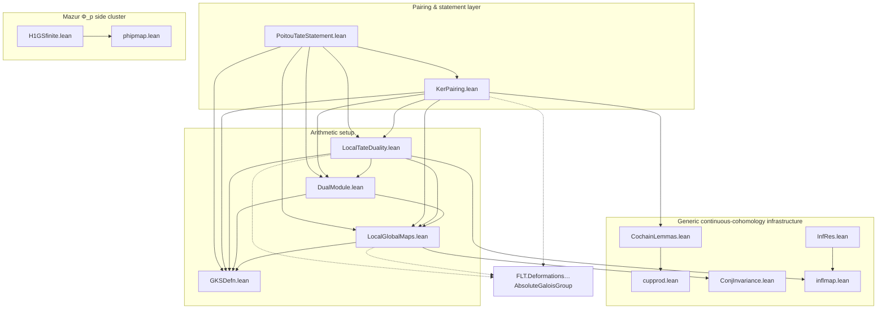

# PoitouTate folder — file overview and dependency graph

This folder formalises the **Poitou–Tate nine-term exact sequence** for a number field `F`,
a finite set `S` of finite places, and a finite discrete module `M` over a finite field `𝔽`,
following the accompanying [`blueprint.tex`](blueprint.tex). The headline statement lives in
[`PoitouTateStatement.lean`](PoitouTateStatement.lean) (`NumberField.PoitouTate.poitouTate`).

The files split into three strata: **generic continuous-cohomology infrastructure** (no number
theory), the **arithmetic setup** (Galois groups, dual modules, local Tate duality), and the
**pairing/statement layer** on top. A small side cluster proves Mazur's `Φ_p` finiteness input.

## Import graph

An arrow `A --> B` means *`A` imports `B`* (so builds bottom-up). `Mathlib` imports are
omitted; the one dependency on the rest of FLT is shown dashed.

The root module [`FLT/Slop/PoitouTate.lean`](../PoitouTate.lean) imports every file in the
folder.

## The files at a glance

| File | Lines | Sorries | Role |
|---|---|---|---|
| [`GKSDefn.lean`](GKSDefn.lean) | 136 | 0 | `F_S` and `G_{F,S}`: the maximal extension unramified outside `S` and its Galois group |
| [`LocalGlobalMaps.lean`](LocalGlobalMaps.lean) | 100 | 0 | The maps `G_v → G_{F,S}` along which everything restricts |
| [`DualModule.lean`](DualModule.lean) | 180 | 3 | `K_S^×`, the dual `M* = Hom_ℤ(M, K_S^×)`, global finiteness + the `H³` torsion lemma |
| [`LocalTateDuality.lean`](LocalTateDuality.lean) | 169 | 11 | Local Tate duality: `K̄ᵥ^×`, local duals, `inv_v`, the local pairing (Milne §I.2) |
| [`cupprod.lean`](cupprod.lean) | 985 | 0 | Cup products on the coinduced resolutions computing continuous cohomology |
| [`inflmap.lean`](inflmap.lean) | 409 | 0 | Functoriality: cochain maps and `Hⁿ(G, X) ⟶ Hⁿ(H, Y)` along `φ : H →ₜ* G` |
| [`ConjInvariance.lean`](ConjInvariance.lean) | 341 | 0 | Conjugation acts trivially on continuous cohomology (prism chain homotopy) |
| [`CochainLemmas.lean`](CochainLemmas.lean) | 605 | 0 | Cocycle-class API, the `ℤ`-scalar bridge `TopRep.toInt`, restriction ∘ cup compatibility |
| [`InfRes.lean`](InfRes.lean) | 65 | 2 | Three-term inflation–restriction statements (blueprint §1.2) |
| [`KerPairing.lean`](KerPairing.lean) | 1418 | 1 | Construction of the kernel pairing `⟨f, g⟩ = ∑_{v∈S} inv_v(x_v)` (blueprint §4) |
| [`PoitouTateStatement.lean`](PoitouTateStatement.lean) | 265 | 8 | `α`, `Kerⁱ`, `β`, `kerPairing`, connecting maps, the nine-term sequence |
| [`phipmap.lean`](phipmap.lean) | 62 | 0 | Continuous `1`-cocycles `Z¹(G, X)` of a `TopRep R G` and their cochain-level identification |
| [`H1GSfinite.lean`](H1GSfinite.lean) | 73 | 1 | Finiteness of `Z¹(G, S)` from Mazur's condition `Φ_p` |
| [`blueprint.tex`](blueprint.tex) | — | — | The mathematical blueprint the folder follows |

Sorry counts are proof-body `sorry`s as of this writing; the deliberate deep inputs are noted
below.

## How the strata fit together

### Generic continuous-cohomology infrastructure (no arithmetic)

Mathlib computes continuous cohomology from homogeneous cochains on coinduced resolutions;
these files build the calculus on top of that:

* **`inflmap.lean`** provides `ContinuousCohomology.cochainsMap` / `ContinuousCohomology.map` —
  the map on cochains and cohomology induced by a continuous homomorphism `φ : H →ₜ* G` and a
  coefficient morphism. Everything called "restriction to `G_v`" downstream is this.
* **`cupprod.lean`** constructs the cochain-level cup product `cupCochain` and the Leibniz
  rule, plus the identification `cohomologyIsoQuot` of cohomology as cocycles-mod-coboundaries.
  Sorry-free and self-contained over Mathlib.
* **`ConjInvariance.lean`** proves conjugation induces the identity on continuous cohomology
  (chain-homotopy argument); consumed by `LocalGlobalMaps.lean` to show the choice of place
  `ṽ | v` doesn't matter.
* **`CochainLemmas.lean`** is the glue written for the pairing: the cocycle-class API
  (`cocycleClass`, "class zero ↔ coboundary", `map_cocycleClass`), the `ℤ`-scalar restriction
  bridge `TopRep.toInt` (cup products are only `ℤ`-bilinear while `kerAlpha` is `𝔽`-linear),
  and `cochainsMap_cupCochain` (restriction commutes with cup products).
* **`InfRes.lean`** states the three-term inflation–restriction sequence (statements only).

### Arithmetic setup

* **`GKSDefn.lean`** defines `IsUnramifiedOutside`, the field `F_S`, and
  `unramifiedOutsideGaloisGroup F S` (`G_{F,S}`) with its profinite topology.
* **`LocalGlobalMaps.lean`** builds `toGKS : Gal(F̄/F) →ₜ* G_{F,S}` and
  `localToGlobal v : G_v →ₜ* G_{F,S}`, and shows the induced maps on cohomology are
  independent of choices (via `ConjInvariance`).
* **`DualModule.lean`** defines `ksUnitsRep` (`K_S^×` as a `TopRep ℤ G_{F,S}`) and
  `dualRep M` (`M* = Hom_ℤ(M, K_S^×)`), proves `M*` finite, and states the global finiteness
  results plus `eq_zero_of_smul_continuousCohomology_three_ksUnitsRep` — the blueprint's `H³`
  torsion lemma, a deliberate deep sorry.
* **`LocalTateDuality.lean`** provides the local coefficients `algClosureUnitsRep` (`K̄ᵥ^×`),
  local duals, and states local Tate duality: finiteness, vanishing in degrees ≥ 3, the
  invariant map `localInvariantMap` (`inv_v`, a deliberate deep sorry — local class field
  theory), and the local pairing.

### Pairing and statement layer

* **`KerPairing.lean`** carries out the blueprint §4 construction: the equivariant coefficient
  glue `K_S^× → K̄ᵥ^×` (`ksUnitsGlue`), the evaluation intertwiners feeding `cupprod`, the
  choice bundle `PairingChoices` (`f∪g = dh`, `res_v g = dψ_v`), the local cocycles
  `x_v = f_v ∪ ψ_v − h_v`, well-definedness in all choices (`pairingValue_congr`), and
  biadditivity. Its one sorry, `sum_localInvariantMap_map_eq_zero`, is global reciprocity
  relative to `S` (Milne ADT I.4.10) — the third deliberate deep CFT input.
* **`PoitouTateStatement.lean`** assembles the objects of the theorem: the restriction maps
  `alpha`, the kernels `kerAlpha`, the duals `beta`, the pairing `kerPairing` (constructed,
  via `KerPairing.lean`), the connecting maps, and the nine-term exact sequence `poitouTate`
  (statement; body `sorry`).

### Mazur `Φ_p` side cluster

`phipmap.lean` → `H1GSfinite.lean` prove that `Z¹(G, S)` is finite for a
compact group satisfying Mazur's condition `Φ_p` — the input making the global universal
deformation ring noetherian. This cluster is independent of the pairing files (it connects to
them only through the root module).

## Deliberate deep inputs (the three "opaque" sorries)

The construction layer is honest modulo exactly three class-field-theory inputs, each isolated
as a single clean statement, matching how the blueprint itself cites them:

1. `localInvariantMap` — `inv_v : H²(G_v, K̄ᵥ^×) ≃ ℚ/ℤ` ([`LocalTateDuality.lean`](LocalTateDuality.lean)).
2. `eq_zero_of_smul_continuousCohomology_three_ksUnitsRep` — the `H³(G_S, K_S^×)` torsion
   lemma ([`DualModule.lean`](DualModule.lean)).
3. `sum_localInvariantMap_map_eq_zero` — global reciprocity relative to `S`
   ([`KerPairing.lean`](KerPairing.lean)).

The remaining sorries (`LocalTateDuality`, `PoitouTateStatement`, `InfRes`, `H1GSfinite`,
`DualModule` finiteness) are scaffolded statements awaiting proofs.
